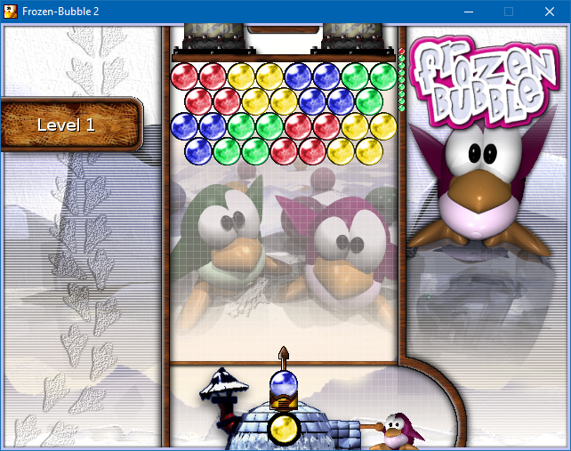

# Frozen Bubble for Windows
This is my build of [Frozen Bubble](http://frozen-bubble.org/) 2 for Windows. It's a slightly-updated version of [Kartik Thakore's port](https://github.com/kthakore/frozen-bubble) with an installer and a couple of small fixes.

## Downloads

**The installer is on the [releases page](https://github.com/bmjcode/frozen-bubble/releases).** I'm only providing a 64-bit version at this time, because that's what any computer built in the last 10 years is likely to be running. (If you *really* need 32-bit, you can probably still build it yourself from source.)

Note it may take a minute or two for the game to start for the first time. This is normal, and appears to be a limitation of the software I used to build the EXE files.

## Tech notes

I built the EXE files using [Strawberry Perl](http://strawberryperl.com/) 5.14.4.1 with [PAR::Packer](https://metacpan.org/pod/PAR::Packer). The `win32` directory contains my build script (`winbuild.pl`), as well as an [NSIS](https://nsis.sourceforge.io/) script to create the installer (`setup.nsi`).

The only change I made to the actual game code was saving high scores and configuration files in `%APPDATA%\Frozen Bubble` on Windows, rather than `~/.frozen-bubble` as used on other platforms.

Beware: Most of this is not my code, and there may be be bugs in it I haven't discovered.
